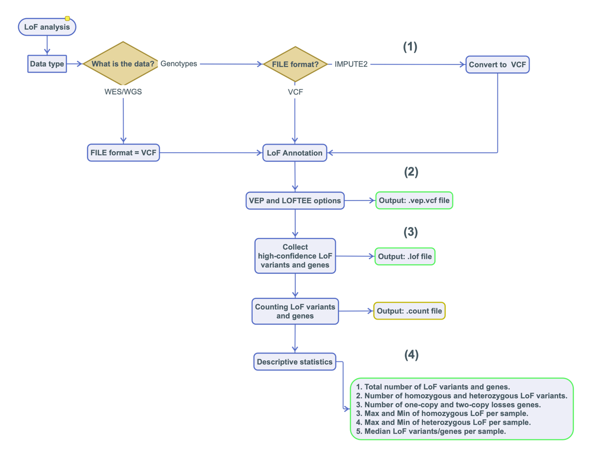

LOFTK (Loss-of-Function ToolKit)
============
[]()
[](https://choosealicense.com/licenses/cc-by-sa-4.0)
[](https://github.com/CirculatoryHealth/LoFTK)

#### This readme
This readme accompanies the paper _"LOFTK: a framework for fully automated calculation of predicted Loss-of-Function variants."_ by [Alasiri A. *et al*. **bioRxiv 2021**]().

--------------

## Background

Predicted Loss-of-Function (LoF) variants in human genes are important due to their impact on clinical phenotypes and frequent occurrence in the genomes of healthy individuals. Current approaches predict high-confidence LoF variants without identifying the specific genes or the number of copies they affect. Here we present an open source tool, the **Loss-of-Function ToolKit (LoFTK)**, which allows efficient and automated prediction of LoF variants from both genotyped and sequenced genomes, identifying genes that are inactive in one or two copies, and providing summary statistics for downstream analyses.

**LoFTK** is a pipeline written in the `BASH` and `Perl` languages to identify loss-of function (LoF) variants using [`VEP`](https://github.com/Ensembl/ensembl-vep) and [`LOFTEE`](https://github.com/konradjk/loftee) efficiently. It will aid in annotating LoF variants, select high confidence (HC) variants, state the homozygous and heterozygous LoF variants, and calculate statistics.


**The Loss-of-Function ToolKit Workflow: finding knockouts using genotyped and sequenced genomes.**



--------------

## Installation and use

### Requirements
All scripts are annotated for debugging purposes - and future reference. The scripts will work within the context of a certain Linux environment - in this case we have tested **LoFTK** on CentOS7 with a SLURM Grid Engine background.

- `Perl >= 5.10.1`
- `Bash`
- [Ensembl Variant Effect Predictor (VEP)](https://github.com/Ensembl/ensembl-vep)
- [`LOFTEE`](https://github.com/konradjk/loftee)
  - Ancestral sequence (human_ancestor.fa[.gz|.rz])
  - PhyloCSF database (phylocsf.sql) for conservation filters
- [`samtools`](https://github.com/samtools/samtools) (must be on path)


### Usage
The only script the user should use is the `run_loftk.sh` script in conjunction with a configuration file `LoF.config`.

You can run **LoFTK** using the following command:

```
bash run_loftk.sh $(pwd)/LoF.config
```

Remember to set all options in the `LoF.config` file before the run and always use the _full path_ to the configuration file, e.g. use `$(pwd)`.

### Description of files

File                              | Description                      | Usage         
--------------------------------- | -------------------------------- | --------------
README.md                         | Description of project           | Human editable
LICENSE                           | User permissions                 | Read only
LoF.config                        | Configuration file               | Human editable
run_loftk.sh                      | Main LoFTK script                | Read only
LoF_annotation.sh                 | Annotation of LoF variants/genes | Read only
allele_to_vcf.sh                  | Converting IMPUT2 format to VCF  | Read only
descriptive_stat.sh               | Descriptive analysis             | Read only


#### Changes log
_Version:_      v1.0.0</br>
_Last update:_  2021-06-08</br>

* v1.0.0 Initial version.

### Contact

If you have any suggestions for improvement, discover bugs, etc. please create an [issues](https://github.com/CirculatoryHealth/LoFTK/issues). For all other questions, please refer to the last author:

Jessica van Setten, PhD | j.vansetten [at] umcutrecht.nl

--------------

#### CC-BY-SA-4.0 License
##### Copyright (c) 2020 University Medical Center Utrecht

Creative Commons Attribution-ShareAlike 4.0 International Public License

By exercising the Licensed Rights (defined in the [LICENSE](LICENSE)), you accept and agree to be bound by the terms and conditions of this Creative Commons Attribution-ShareAlike 4.0 International Public License ("Public License"). To the extent this Public License may be interpreted as a contract, you are granted the Licensed Rights in consideration of your acceptance of these terms and conditions, and the Licensor grants you such rights in consideration of benefits the Licensor receives from making the Licensed Material available under these terms and conditions.

The above copyright notice and this permission notice shall be included in all copies or substantial portions of the Software.

THE SOFTWARE IS PROVIDED "AS IS", WITHOUT WARRANTY OF ANY KIND, EXPRESS OR IMPLIED, INCLUDING BUT NOT LIMITED TO THE WARRANTIES OF MERCHANTABILITY, FITNESS FOR A PARTICULAR PURPOSE AND NONINFRINGEMENT. IN NO EVENT SHALL THE AUTHORS OR COPYRIGHT HOLDERS BE LIABLE FOR ANY CLAIM, DAMAGES OR OTHER LIABILITY, WHETHER IN AN ACTION OF CONTRACT, TORT OR OTHERWISE, ARISING FROM, OUT OF OR IN CONNECTION WITH THE SOFTWARE OR THE USE OR OTHER DEALINGS IN THE SOFTWARE.

Reference: https://choosealicense.com/licenses/cc-by-sa-4.0/#.
